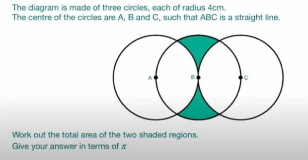

Bare in mind, this question was asked to 16 year olds in the UK during their final maths exam.

## Question

## Solution

$$
\begin{aligned}
\text{Let N the intercection of circles A and B at the top} \\
AB = 4 \\
\text{Equilateral Triangle ABN - side length 4, internal angles all 60°}\\
\text{Area: } \frac{1}{2}(4)(4)\sin{60} = 4\sqrt{3}\\
\text{Notice that lines AN and AB form a segment of circle A:  }\\
\frac{60}{360}(\pi 4^2) = \frac{8}{3}\pi\\
\text{Thus, we can get the area of the remainder of the circle-segment by finding the difference: } \\
\frac{8}{3}\pi-4\sqrt{3}
\end{aligned}
$$

OK I got bored here Lol but I think you see where I'm headed. Not too complex but tricky to see where to start
May revisit!
