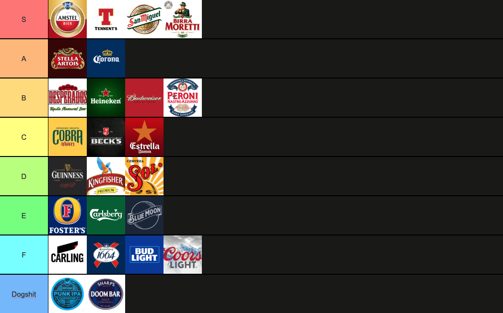

Here's a tier-list of the 17 most popular pints in Scotland - it might be a bit controversioal, but Carling is far to gassy for my taste, and if you're on a pub crawl, you don't want to fill yourself up with Guiness (it's about 3 loaves of bread per pint). Tennents carries a bad reputation, but if you're on a budget, its price and widespread availability make it an undeniable staple across the country.

What do pint glasses and traffic cones have in common? Scottish teens love to steal them. 
Here I track the metrics of the lucrative pint glasses that are currently in my kitchen cupboard.

- [x] Amstel (x 1)
- [ ] Stella Artois
- [x] Corona (x 2)
- [ ] Peroni
- [ ] San Miguel
- [ ] Heineken
- [ ] Becks
- [x] Guiness (x 2)
- [ ] Budweiser
- [ ] 1664
- [ ] Fosters
- [ ] Carlilng
- [ ] Peroni
- [ ] Carlsberg
- [ ] Coors Light